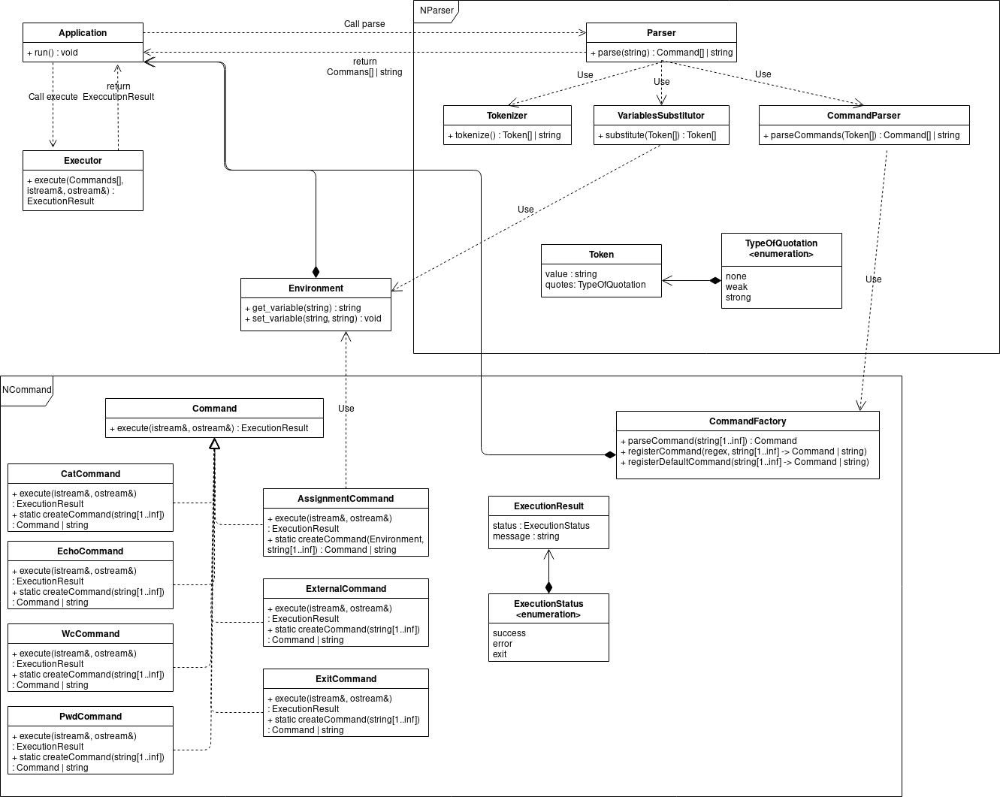

# CLI
Bash-like интерпретатор командной строки
## Installation
Для сборки потребуется установить следующее окружение
- СMake версии не ниже 3.10
- библиотеку Boost версии не ниже 1.64
- Современную версию компилятора gсс или clang для сборки кода написанного на C++17
## Build
Сборку в системе linux можно выполнить следующим набором команд
- cd CLI
- mkdir build
- cd build
- cmake \.\.
- make

Запуск программы
- ./cli

Запуск тестов
- ./cli\_test
## Architecture

Application -- основной класс, взаимодействующий с пользователем

Он инициализирует окружение(Environment), регистрирует команды в CommandFactory

Ввод пользователя парсится на команды с помощью Parser и выполняется с помощью Executor

Parser разбивает строку на составлящие элементы с помощью Tokenizer, подставляет значения переменных с помощью VariablesSubstitutor и создает список команд с помощью CommandParser, который использует команды зарегестрированные в CommandFactory

Команды задаются как наследники класса Command\\
